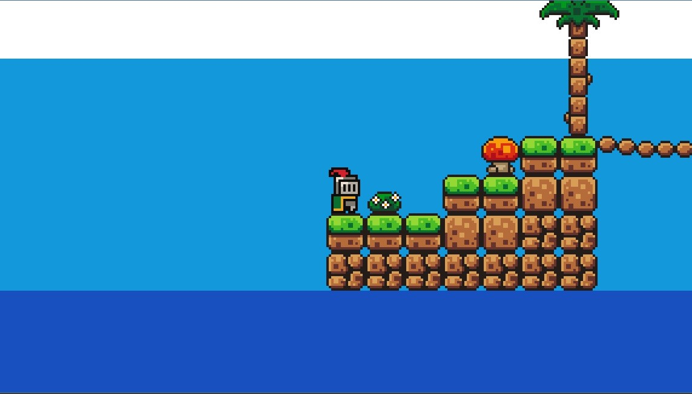
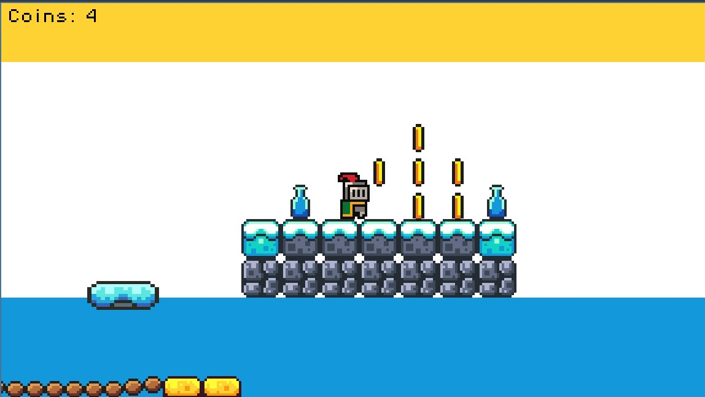
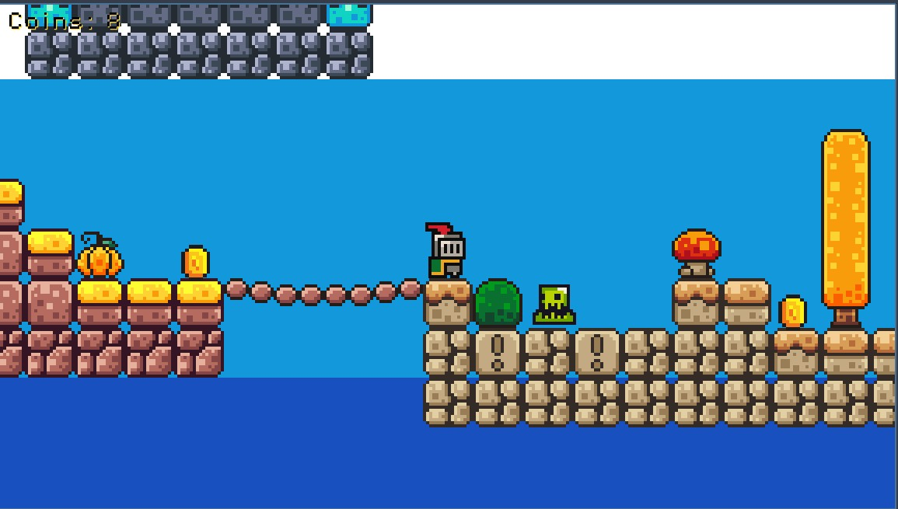
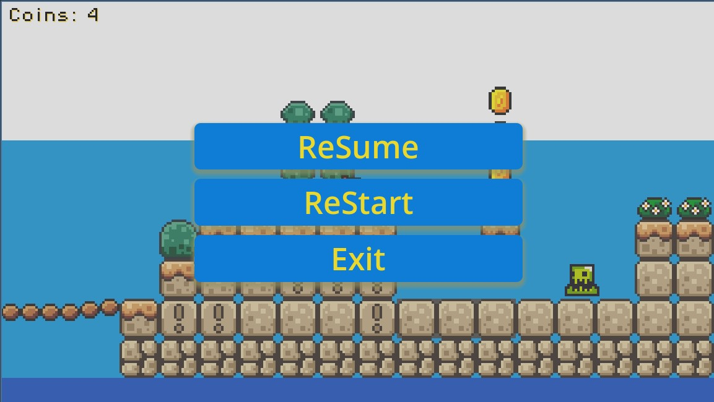

# Glint

Glint is a fun and challenging game developed by Mhyahs. Navigate through exciting levels, collect coins, and defeat bosses to win!

## Gameplay

- Explore different levels full of obstacles and surprises.
- Collect coins to increase your score.
- Face unique bosses at the end of each world.
- Use power-ups and special abilities to overcome difficult challenges.

## Controls

- **Arrow Keys**: Move your character  
- **Spacebar**: Jump  
- **Z**: Attack  
- **X**: Use special ability  
- **Esc**: Pause the game  

## Screenshots

Here are some screenshots from Glint.

  
*gameplay*

  
*Collecting coins in action*

  
*little enemies on way*

  
*The game's pause menu*

## Credits

- **Game Developer:** [Mhyahs](https://github.com/Mhyahs)
- Special thanks to anyone who contributed to playtesting, feedback, or assets.

## Special Thanks

This game was made with the help of the following tutorial:  
[YouTube: "How to Make a Platformer Game"](https://youtu.be/LOhfqjmasi0?si=SZMFbYXbCzve5R71)

## License

This project is licensed under the MIT License. See the [LICENSE](LICENSE) file for details.

---

*Show your support by starring the repository!*
